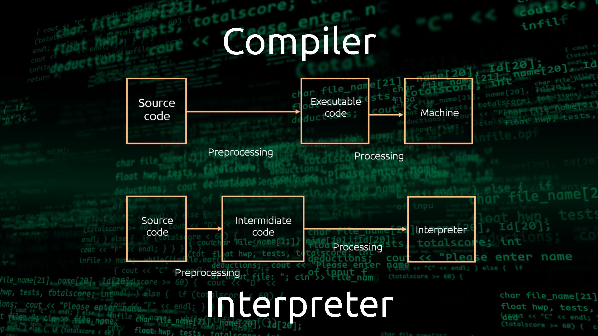

# 
 Introduction

## What is Compiler?

A compiler is a software program that takes source code written in a high-level programming language and converts it into a lower-level language that can be executed by a machine. The output of this process is often referred to as object code or machine code. 
The purpose of a compiler is to enable the execution of a program on a specific hardware platform.

a simplified overview of how a compiler works:

1. **Source Code:** Programmers write human-readable code in a high-level programming language like C, C++, Java, or Python.

2. **Compilation:** The source code is fed into a compiler. The compiler analyzes the code, performs various optimizations, and generates an equivalent machine code or intermediate code.

3. **Object Code/Executable:** The output of the compiler is typically a binary file or set of files containing machine code or intermediate code. This can be directly executed by the computer's hardware or by a virtual machine, depending on the programming language.

4. **Linking (optional):** In some languages, the compilation process involves linking, where multiple compiled files or libraries are combined to create the final executable.

The process of compiling code involves several steps:

1. **Lexical Analysis**: The compiler splits the source code into lexemes, which are individual code fragments that represent specific patterns in the code. The lexemes are then tokenized in preparation for syntax and semantic analyses.

2. **Syntax Analysis**: The compiler verifies that the code's syntax is correct, based on the rules for the source language. This process is also referred to as parsing. During this step, the compiler typically creates abstract syntax trees that represent the logical structures of specific code elements.

3. **Semantic Analysis**: The compiler verifies the validity of the code's logic. This step goes beyond syntax analysis by validating the code's accuracy. For example, the semantic analysis might check whether variables have been assigned the right types or have been properly declared.

4. **Intermediate Code Generation**: After the code passes through all three analysis phases, the compiler generates an intermediate representation (IR) of the source code. The IR code makes it easier to translate the source code into a different format. However, it must accurately represent the source code in every respect, without omitting any functionality.

5. **Optimization**: The compiler optimizes the IR code in preparation for the final code generation. The type and extent of optimization depends on the compiler. Some compilers let users configure the degree of optimization.

6. **Output Code Generation**: The compiler generates the final output code, using the optimized IR code.

Compilers are important because they enable developers to write code in high-level programming languages, which are easier to understand and more human-readable than machine code. They also provide portability, as the machine code generated can be run on many different operating systems and hardware architectures. Additionally, compilers can provide programmer security by preventing memory-related errors, such as buffer overflows, by analyzing and optimizing the code.

However, it's important to note that the code produced by a compiler is platform-dependent. This means that compiled code produces a machine-readable and machine-specific executable file that only the particular type of machine is able to execute. For example, code compiled on a Windows machine won’t run on a Mac or Linux system without being recompiled.

The main advantages of using a compiler include:

- **Performance:** Compiled code often runs faster than interpreted code because it's already translated into machine code.
  
- **Platform Independence:** In some cases, the compiled code can be executed on different platforms without modification, especially if it's compiled to an intermediate code that's interpreted by a virtual machine.

### Compiled Code VS Interpreted Code

Compiled code and interpreted code represent two different approaches to executing computer programs. Here are the key differences between them:

### Compiled Code:

1. **Translation Process:**
   - **Compilation:** The entire source code is translated into machine code or an intermediate code by a compiler before execution.
   - **Output:** The result of compilation is often an executable file containing machine code that can be directly executed by the computer's hardware.

2. **Execution:**
   - **Direct Execution:** The compiled code is executed directly by the computer's processor.
   - **Performance:** Generally, compiled code tends to be faster than interpreted code because it is pre-translated into machine code.

3. **Examples:**
   - Common examples of compiled languages include C, C++, and Rust.

4. **Portability:**
   - Compiled code is often less portable than interpreted code, as the compiled binary may be specific to the architecture or platform for which it was compiled.

### Interpreted Code:

1. **Translation Process:**
   - **Interpretation:** The source code is translated and executed line by line or statement by statement by an interpreter.
   - **Output:** No separate compilation step is required, and the source code is directly interpreted during execution.

2. **Execution:**
   - **Interpretation:** The interpreter reads and executes the source code directly without generating an intermediate machine code or binary file.
   - **Performance:** Interpreted code can be slower than compiled code because it is translated on-the-fly during execution.

3. **Examples:**
   - Examples of interpreted languages include Python, JavaScript, and Ruby.

4. **Portability:**
   - Interpreted code is often more portable as it can be run on any system with the appropriate interpreter. However, the interpreter itself needs to be available for each platform.

> in summary, A compiler translates a programming language (source language) into executable code (target language)

