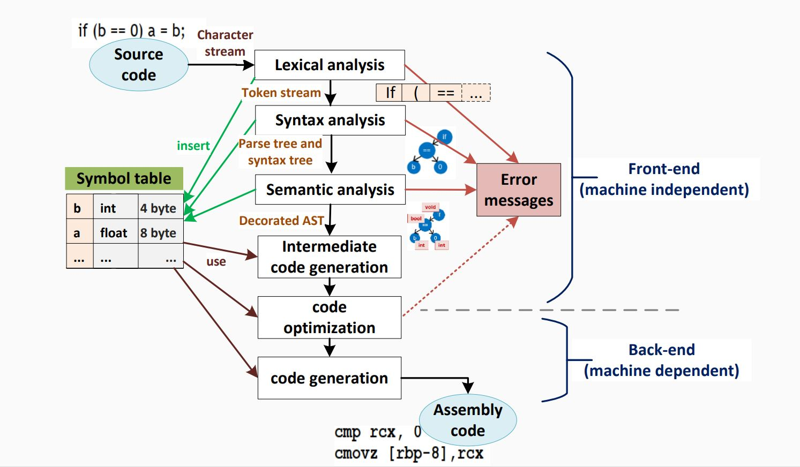

# <center> Compiler Basic


## Compiler Formalization

In compiler design, it's essential to precisely describe the input (source code) and output (machine code) of a compiler.

**Input:** Source code (programming language)  
**Output:** Assembly (machine) code

## Describing Programming Language Syntax

Programming languages have two crucial components: syntax and semantics.

### Syntax

Syntax defines which strings of symbols are valid expressions in the language.


#### Example (C++):
```cpp
int z = 0;  // Valid statement
std::cout << "z+1=" << z++ << std::endl;  // Valid statement
```


### Semantics

Semantics defines the meaning or behavior of valid expressions.

### Describing Syntax using BNF Grammar

Backus-Naur Form (BNF) is a formal notation used to describe the syntax of programming languages.

#### Example BNF Grammar:

```bnf
<Statement> ::= <AssignmentSt> | <ForST> | '{' <StatementList> '}' | 𝜖
<AssignmentSt> ::= <Id> '=' <Exper>
<ForST> ::= 'for' <Id> '=' <Expr> 'to' <Expr> <DoPart>
<DoPart> ::= 'do' <Statement>
<StatementList> ::= <Statement> ';' <StatementList> | <Statement>
```

## Compilation Steps

Compiling a program involves several steps, and it's crucial to understand the process.

1. **Intermediate Representations (IRs):**
   - Compiler uses different program Intermediate Representations.
   - These IRs facilitate necessary program manipulations (analysis, optimization, code generation).

#### Example Compilation Steps in C++:

```cpp
#include <iostream>

int main() {
    int z = 0;
    std::cout << "z+1=" << z++ << std::endl;
    return 0;
}
```


## Compiler Phases





### Compiler Architecture:

- **Parser:** Responsible for analyzing the syntactic structure of the source code and generating a parse tree or abstract syntax tree (AST).

- **Scanner:** Tokenizes the source code, breaking it down into a sequence of tokens for the parser to analyze. 

- **Type Checker:** Ensures that the types of expressions and statements are consistent and adherent to the language's rules.

- **Code Generators:** Translate the intermediate representation (IR) or AST into machine code or another target language.

- **Error Manager:** Handles and reports errors that occur during the compilation process.


> **Note:** The order of these components may vary depending on the specific compiler design
>
> **Note:** The parser acts as a "driver" in the compiler design, meaning it plays a central role in coordinating the compilation process.
>
> **Note:** It analyzes the syntax of the source code, constructs a hierarchical representation (such as a parse tree), and passes this structure to subsequent stages of the compiler.


### Steps in System Context:


- **Preprocessing:** Expanding macros and collecting program sources.
- **Compilation:** Parsing the preprocessed source code and generating an intermediate representation.
- **Linking:** Joining together object files and resolving external references.
- **Loading:** Mapping virtual addresses to physical address space.


## Compile Passes

**Definition:**
A compile pass is a stage in the compilation process where the source program undergoes transformations specified by its phases, producing intermediate output.

- **Single-pass Compiler:** Scans the complete source code only once. Example: Pascal compiler.
- **Multi-pass Compiler:** Processes the source code multiple times, improving the code pass by pass until the final pass emits the final code.

## Compiler Errors

A good compiler assists the programmer in locating and tracking down errors:

- **Compile-time Errors:** Occur during program compilation.
  - Lexical errors
  - Syntactic errors
  - Semantic errors

- **Run-time Errors:** Occur while the program is running after being successfully compiled.
  - Crashes
  - Logical errors

## Types of Errors in Compilers

Common programming errors can occur at various levels:

1. **Lexical Errors:** Misspellings of identifiers, keywords, or operators.
2. **Syntactic Errors:** Misplaced semicolons, extra or missing braces.
3. **Semantic Errors:** Type mismatches between operators and operands.
4. **Logical Errors:** Incorrect reasoning by the programmer.

## Error Recovery

**Definition:**
Error recovery is a process that takes action against errors to reduce negative effects as much as possible.

Common error-recovery strategies for parser error handling:

1. **Panic-mode**
2. **Phrase-level**
3. **Error-productions**
4. **Global-correction**

## Compiler Types

- **Decompiler:** Translates from a low-level language to a higher-level one.
- **Cross-compiler:** Produces code for a different `CPU` or operating system.
- **Transpiler (Source-to-Source Compiler):** Translates between `high-level` languages.
- **Bootstrap Compiler:** Temporary compiler used for compiling a more permanent or better-optimized compiler.
- **Compiler-compiler:** Produces a compiler (or part of one) in a generic and reusable way (e.g., `ANTLR`, `FLEX`, `YACC`, `BISON`).


#### **reminder Interpreter**

An interpreter is another computer program like compiler that executes instructions written in a programming language immediately statement by statement.


## Just-In-Time (JIT) Compilation

### Definition

The JIT compiler, or dynamic translator, reads bytecodes (in a bytecode-compiled system) in many sections (or in full, rarely) and compiles them dynamically into machine code.

- This can be done per-file, per-function, or even on any arbitrary code fragment.
- As a result, the program can run faster.
- Provides lazy/late compiling.
- The code can be compiled when it is about to be executed and then cached and reused later without needing to be recompiled.

### Advantages of JIT Compilation

1. **Improved Performance:**
   - JIT compilation can result in faster execution of the program since machine code is generated dynamically.

2. **Lazy Compilation:**
   - Compilation is deferred until the code is about to be executed. This allows for better optimization decisions based on runtime information.

3. **Caching and Reuse:**
   - Once code is compiled, it can be cached and reused in subsequent executions, reducing the need for repeated compilation.

4. **Adaptability:**
   - JIT compilation allows for adaptability to the runtime environment, optimizing the code based on the specific characteristics of the executing system.


Just-In-Time (JIT) compilation is a technique employed in the field of compiler design to enhance the runtime performance of programs. Unlike traditional ahead-of-time (AOT) compilation, where source code is translated into machine code before execution, JIT compilation occurs dynamically during program execution. This approach combines elements of interpretation and compilation, seeking to leverage the advantages of both.

In JIT compilation, the source code is initially translated into an intermediate representation, often referred to as bytecode or an intermediate language. This intermediate code is not directly executed by the hardware but is designed to be more portable and platform-independent than the original source code.

During runtime, as the program is executed, the JIT compiler analyzes the intermediate code and translates it into machine code that is specific to the underlying hardware architecture. This process occurs on-the-fly, just before the corresponding code is executed, hence the term "just-in-time." The generated machine code is then executed directly by the hardware, resulting in potentially improved performance compared to interpreting the original source or intermediate code.


### Use Cases

- **Bytecode-Compiled Systems:**
  - Commonly used in virtual machines that execute bytecode, such as Java Virtual Machine (JVM) or Common Language Runtime (CLR) in .NET.

- **Execution Speed Optimization:**
  - JIT compilation is employed to improve the execution speed of programs, especially in environments where interpretation of high-level code would be too slow.

- **Memory Efficiency:**
  - By compiling only the necessary portions of code during runtime, JIT compilation can contribute to more efficient memory usage.


