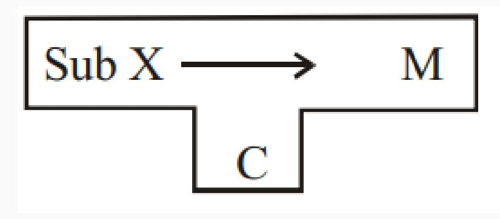
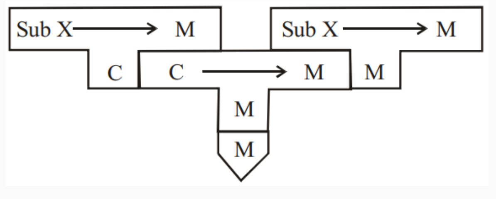
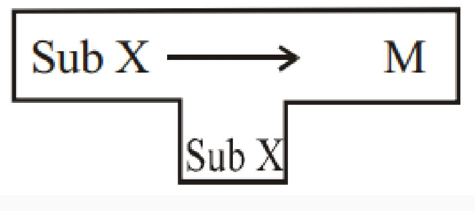
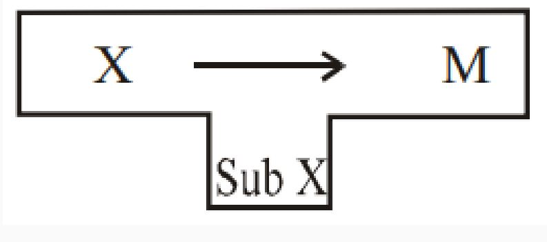

# 
 Bootstrapping

# 

**Definition:**
Bootstrapping is a technique where a simple program initiates a more complex system of programs. In the context of compilers, it often involves the process of writing a compiler for a programming language using another compiler written in the same language. This self-compiling process allows for the creation of more sophisticated compilers.

**Example:**
Consider the BIOS (Basic Input/Output System), which initializes and tests hardware, peripherals, and external memory devices when a computer boots. In compiler design, bootstrapping might involve writing a compiler for a language `A` using a compiler written in the same language `A`.

### T-Diagrams:

**Definition:**
T-diagrams are a graphical notation used to represent the relationships between different programming languages in the context of compiler design. The notation takes the form of `A ---(C)---> B`, where a compiler written in language `C` processes source code in language `A` and produces executable code in language `B`.

### Full Bootstrapping:

**Goal:**
The goal of full bootstrapping is to implement a compiler for language `X` on a machine `M`, given the presence of a language `C` compiler/assembler on the same machine.

**Steps:**

1. **Write Compiler for Subset `X` in `C`:**
   - Begin by writing a compiler for a small part (subset) of language `X` using the language `C`. Compile this on machine `M`, where the `C` compiler already exists.

# 

2. **Compile Compiler for Sub `X`:**
   - Use the existing language `C` compiler to compile the compiler written in **Step 1**. This creates a compiler that can process the subset language `Sub X`.

# 

3. **Translate Subset Compiler (Sub X):**
   - Translate the subset compiler (Sub X) written in **Step 1** into the subset language (Sub X). This is a necessary step in the process.

# 

4. **Compile Subset Compiler (Sub X):**
   - Compile the subset compiler (Sub X) from **Step 3** using the compiler built in **Step 2**. This further refines the compiler for `Sub X`.

# 

5. **Extend Subset Language (Sub X):**
   - Extend the subset language (Sub X) compiler from **Step 3** into a compiler for the full language `X`. Importantly, this step is still performed using only the subset language `Sub X`.

# 

6. **Compile Full Language Compiler:**
   - Finally, compile the full language `X` compiler using the compiler built in **Step 4**. At this point, you have a compiler for the full language `X` implemented on machine `M`.

# 

This comprehensive process demonstrates the self-sustaining nature of bootstrapping, where each step builds upon the capabilities of the previous one, ultimately leading to the creation of a compiler for a more complex language.

### Simple Bootstrapping:

**Process:**
If a compiler or interpreter already exists for the language `A` on the target machine `M`, the process of bootstrapping is simplified.

