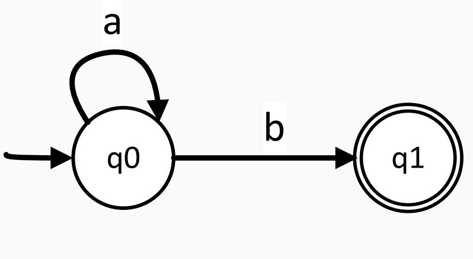

# 
 Formal Languages and Lexical Analysis  

### Lexical Analysis Goal

**Goal:** The primary objective of lexical analysis is to partition an input string into meaningful elements called tokens.

**Tasks of Lexical Analyzer:**
1. Recognize substrings corresponding to tokens.
2. Return tokens with their categories.

**Main Tasks:**
- Read input characters of the source program.
- Group them into lexemes.
- Produce, as output, a sequence of tokens for each lexeme in the source program.

**Output:**
- The output of lexical analysis is a stream of tokens, which serves as the input to the parser.

### Formal Languages

**Definition:**
- A language over $ Σ $ is a subset of $ Σ* $ (set of all words over $ Σ $ ).
- Alphabet $ Σ: A $ finite set of elements.
- For the lexer: Characters.
- For the parser: Token classes/symbol types.
- Words (strings): Sequences of elements from the alphabet Σ.
- Example: If $ Σ = \{𝑎, 𝑏\} $, then $ Σ* = \{\epsilon, 𝑎, 𝑏, 𝑎𝑎, 𝑎𝑏, 𝑏𝑎, 𝑏𝑏, 𝑎𝑎𝑎, 𝑎𝑎𝑏, 𝑎𝑏𝑎, ...\} $
- Example of an infinite language over $Σ: 𝐿1 = \{𝑎𝑏, 𝑎𝑏𝑎𝑏, 𝑎𝑏𝑎𝑏𝑎𝑏, ...\} = \{{(𝑎𝑏)}^𝑛 | 𝑛 ≥ 1\} $

### Formal Languages Description Notations

1. **Sets:** $ 𝐿1 = \{ {}𝑎^{𝑛} 𝑏 | 𝑛 ≥ 0 \} $
2. **Grammars:** `<𝐴> ::= 𝑎𝐴 | 𝑏`
3. **Automata:**

# 

4. **Regular Expressions (Regex):** Used only for regular languages.
   - Example: 𝑎*

### Formal Grammars

**Definition:**
- 𝐺 = {𝑁, Σ, 𝑃, 𝑆}, where
  - 𝑁: A finite set 𝑁 of nonterminal symbols, disjoint from the strings formed from 𝐺.
  - Σ: A finite set of terminal symbols, disjoint from 𝑁.
  - 𝑃: A finite set 𝑃 of production rules, each rule of the form 𝛼 → 𝛽.
  - 𝑆: A distinguished symbol 𝑆 ∈ 𝑁, the start symbol.

**Convention:**
- Use small letters for terminals and capital letters for non-terminals or variables when writing grammar production rules.

### Regular Grammars

**Definition:**
- A grammar 𝐺 = (𝑁, Σ, 𝑃, 𝑆) is right-linear if all productions are of the form:
  - 𝐴 → 𝑥𝐵 | 𝑥 | 𝜖, where 𝐴, 𝐵 ∈ 𝑁 and 𝑥 ∈ Σ*

**Definition:**
- A grammar is left-linear if all productions are of the form:
  - 𝐴 → 𝐵𝑥 | 𝑥 | 𝜖, where 𝐴, 𝐵 ∈ 𝑁 and 𝑥 ∈ Σ*

**Regular Grammar:**
- A regular grammar is one that is either right-linear or left-linear.

### Deterministic Finite Acceptor (DFA)

**Definition:**
A deterministic finite acceptor or `DFA` is defined by the quintuple
$$ [ M = (Q, \Sigma, \delta, q_0, F) ] $$
where
- $( Q )$ is a finite set of internal states,
- $( \Sigma )$ is a finite set of symbols called the input alphabet,
- $( \delta: Q \times \Sigma \rightarrow Q )$ is a total function called the transition function,
- $( q_0 \in Q )$ is the initial state,
- $( F \subseteq Q )$ is a set of final states.

### Non-deterministic Finite Acceptor (NFA)

**Definition:**
A non-deterministic finite acceptor or `NFA` is defined by the quintuple
$$ [ M = (Q, \Sigma, \delta, q_0, F) ] $$
where
- $( Q )$ is a finite set of internal states,
- $( \Sigma )$ is a finite set of symbols called the input alphabet,
- $( \delta: Q \times (\Sigma \cup \{\varepsilon\}) \rightarrow 2^Q )$ is a total function called the transition function,
- $( q_0 \in Q )$ is the initial state,
- $( F \subseteq Q )$ is a set of final states.

### NFA vs. DFA

**DFA Transition Function:** $( \delta: Q \times \Sigma \rightarrow Q )$

**NFA Transition Function:** $( \delta: Q \times (\Sigma \cup \{\varepsilon\}) \rightarrow 2^Q )$

- `NFA` can have multiple transitions for one input in a given state.
- `NFA` can have no transition for an input in a given state.
- `NFA` can make a transition without consuming an input symbol (λ or ε-transition).

### Computations of a DFA

- For each input string, there is exactly one path in a `DFA` (O(n)).
$$ [ L(M) = \{ w \in \Sigma^* : \delta^*(q_0, w) \in F \} ] $$ 

### Computations of an NFA and Language Acceptance

- For an input string, there are multiple possible computation paths in an `NFA` $(O(2^n))$.
$$[ L(M) = \{ w \in \Sigma^* : \delta^*(q_0, w) \cap F = \emptyset \} ] $$

### NFA vs. DFA Implementation

- `DFA`s are generally simpler to implement due to their deterministic nature.
- `NFA`s may require additional mechanisms to handle non-deterministic transitions.
- Simulation of `NFA` requires tracking multiple possible states simultaneously.

