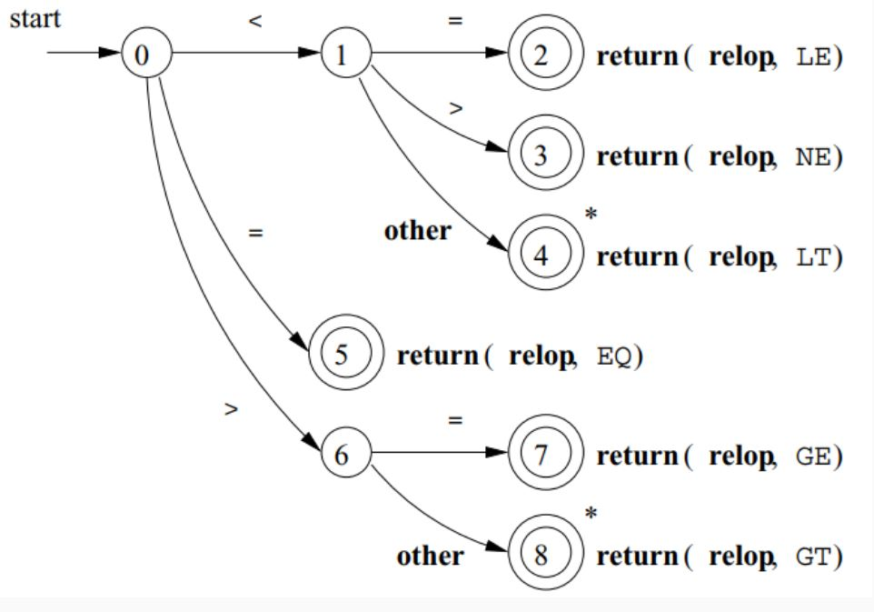

# <center> Manual Construction of Lexers


#### Recognition of Tokens

The manual construction of a lexical analyzer involves several steps:

1. **Describe Lexical Patterns:**
   - Define regular expressions (RE) to describe the lexical pattern of each token type.

2. **Construct NFAs:**
   - Create Non-deterministic Finite Automata (NFAs) for each regular expression.

3. **Convert NFAs to DFAs:**
   - Convert the NFAs to Deterministic Finite Automata (DFAs) for efficiency.

4. **Minimize DFA States:**
   - Minimize the number of states in the DFAs where possible.

5. **Construct Transition Diagrams:**
   - Build lexical analyzer transition diagrams from the DFAs.

6. **Implement Transition Diagrams:**
   - Translate the transition diagrams into actual code for the lexical analyzer.

#### Transition Diagrams: Notations

As an intermediate step, patterns are converted into stylized flowcharts called "transition diagrams." These diagrams incorporate DFAs for recognizing tokens. If it's necessary to retract the forward pointer one position (i.e., the lexeme doesn't include the symbol that got us to the accepting state), a '*' is placed near that accepting state.

#### Transition Diagram Examples:

1. **Relational Operations (RELOPs):**
   - Diagram for recognizing relational operators like `<`, `<>`, `=`, `>=`, `<=`, `==`, etc.



2. **Reserved Words and Identifiers:**
   - Diagram for recognizing reserved words and identifiers in the source code.


3. **Unsigned Numbers:**
   - Diagram for recognizing unsigned numerical values.


#### Lexer Input and Output:

The lexical analyzer takes the source code as input and produces a stream of tokens as output. This token stream is then passed to the parser for further syntactic analysis.


#### Static Scope and Block Structure:

- The scope of a declaration is implicitly determined by where it appears in the program.
- Code blocks group declarations and statements, often delimited by braces `{}` or keywords like `begin` and `end`.


#### Static scope and block structure in C++


#### White Spaces:

- Whitespaces are defined as tokens using ***space characters*** (' '), ***tabs*** ('\t), and ***end-of-line characters*** ('\r', '\n').
- In most languages, whitespaces and comments can occur between any two tokens and are generally ignored by the parser.

#### Comments:

- Comments are detected and discarded by the lexer.
- They can be single-line or multi-line.
- Lexical analyzers always find the next non-whitespace, non-comment token.

#### Lexical Errors and Error Recovery:

- Lexical errors occur when no token pattern matches the remaining input.
- A "panic mode" recovery strategy involves deleting characters until a well-formed token is found.
- Other recovery actions include deleting, inserting, replacing, or transposing characters.


##### **Panic Mode Recovery**

Panic mode recovery is one of the error recovery strategies used in compiler design. It is commonly used by most parsing methods. In this strategy, when an error is discovered, the parser discards input symbols one at a time until it finds a designated set of synchronizing tokens. These tokens are delimiters such as semicolons or ends, which indicate the end of an input statement.

Here is a simple example of how panic mode recovery works:

```cpp
int a, 5abcd, sum, $2;

```

In this case, the parser would discard the input symbols one at a time until it finds a synchronizing token (like a semicolon). However, this strategy may lead to semantic or runtime errors in further stages.
The panic mode recovery process can be implemented in a high-level parsing function. This function is responsible for detecting parsing errors and re-synchronizing the input stream by skipping tokens until a suitable spot to resume parsing is found. For a grammar that ends statements with semicolons, the semicolon becomes the synchronizing token.
Here is an example of a top-level parsing function that uses panic mode recovery:

```cpp
static int doParsing(void){
  initialize errorcounter to zero

  WHILE TYPEOFTOKEN is not EOF DO
     SWITCH TYPEOFTOKEN
     CASE ID:       -- ID is in the FIRST set of assignment()
        returnStatus = assignment()
        break
     CASE PRINT:    -- PRINT is in the FIRST set of print()
        returnStatus = print()
        break
     CASE ...
         -- Other cases can go here, for other statement types
         break
     DEFAULT:
        eprintf("File %s Line %ld: Expecting %s or %s;"
           " found: %s '%s'",
              filename,
              LINENUMBER,
              tokenType(ID),
              tokenType(PRINT),
              tokenType(TYPEOFTOKEN),
              LEXEMESTR );
        returnStatus = FALSE
        break
     END SWITCH

     IF returnStatus is FALSE THEN
        CALL panic()
        increment errorcounter
     ENDIF
  END WHILE
  return errorcounter
}

```

In this example, each parsing function is a Boolean function. Each parsing function may succeed, in which case we continue parsing, or fail, in which case we stop parsing and return the failure indication to our parent function.


#### Lexical Analysis Challenges:

- In some languages like Fortran, whitespace is insignificant, making lexical analysis challenging.
- Lookahead is required to distinguish between tokens, and language design should aim to minimize lookahead.

#### Lookahead:

- Lookahead is necessary to decide where one token ends and the next begins.
- It is required to disambiguate between similar constructs (e.g., `==` and `=`).
- Some languages, like PL/1, where keywords are not reserved, may require more extensive lookahead for lexical analysis.


