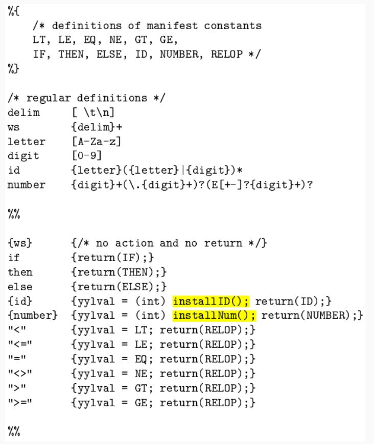

# <center> Automatic construction of Lexers


#### Lexer Construction Steps

**Input: Token Specifications**
- A list of regular expressions (RE) in priority order that define the patterns of tokens in a programming language.

**Output: Lexer**
- A program that reads an input stream and breaks it up into tokens based on the specified regular expressions.

**Algorithm:**

1. **Convert REs into NFAs:**
   - Transform regular expressions into Non-deterministic Finite Automata (NFAs).
   - Each regular expression corresponds to an NFA that recognizes the language defined by that expression.

2. **Convert NFAs to DFA:**
   - Convert NFAs to Deterministic Finite Automata (DFAs) for efficiency.
   - Create a DFA that accepts the same language as the original NFA.

3. **Convert DFA into Transition Table:**
   - Create a transition table that represents the DFA.
   - The table indicates the next state for each combination of current state and input symbol.

#### The Lex/Flex Tool

Flex, also known as Fast Lexical Analyzer Generator, is a tool used for generating lexical analyzers, also known as "scanners" or "lexers". It was written in C around 1987 by Vern Paxson and is often used in conjunction with other tools like Berkeley Yacc parser generator or GNU Bison parser generator.

## Structure of Lex Programs

The structure of a lex program is as follows:

```python

declarations
%%
translation rules
%%
auxiliary functions
```

- **Manifest constants**: These are enclosed in `{}` brackets and can include definitions for variables, regular definitions, and manifest constants.

- **Declarations**: These are the variable declarations that are used in the program.

- **Translation rules**: Each rule has the form: `Pattern { Action }`. Patterns are regular expressions, and actions are code fragments, typically in C.

- **Auxiliary functions**: These are additional functions that can be compiled separately and loaded with the lexical analyzer.

## Lexical Analysis

Lexical analysis, or lexing, is the process of converting a sequence of characters into a sequence of tokens. The lexical analyzer takes in a stream of input characters and returns a stream of tokens.

## Running a Lex Program

To run a lex program, you need to follow these steps:

1. Write an input file that describes the lexical analyzer to be generated. This file should be named `lex.l` and written in the lex language. The lex compiler transforms `lex.l` into a C program, in a file that is always named `lex.yy.c`.

2. Compile the `lex.yy.c` file into an executable file. This can be done using the C compiler.

3. Run the executable file. The output file will take a stream of input characters and produce a stream of tokens.

Here is an example of how to run a lex program:

```bash
flex filename.l # or flex filename.lex depending on the extension file is saved with
gcc lex.yy.c
./a.out
```

Then provide the input to the program if it is required. Press `Ctrl+D` or use some rule to stop taking inputs from the user.

## Advantages and Disadvantages of Flex

Flex has several advantages:

- **Efficiency**: Flex-generated lexical analyzers are very fast and efficient, which can improve the overall performance of the programming language.
- **Portability**: Flex is available on many different platforms, making it easy to use on a wide range of systems.
- **Flexibility**: Flex is very flexible and can be customized to support many different types of programming languages and input formats.
- **Easy to Use**: Flex is relatively easy to learn and use, especially for programmers with experience in regular expressions.

However, there are also some disadvantages:

- **Steep Learning Curve**: While Flex is relatively easy to use, it can have a steep learning curve for programmers who are not familiar with regular expressions.
- **Limited Error Detection**: Flex-generated lexical analyzers can only detect certain types of errors, such as syntax errors and misspelled keywords.
- **Limited Support for Unicode**: Flex has limited support for Unicode, which can make it difficult to work with non-ASCII characters.
- **Code Maintenance**: Flex-generated code can be difficult to maintain over time, especially as the programming language evolves and changes. This can make it challenging to keep the lexical analyzer up to date with the latest version of the language.




#### Lex Architecture

- Describes how Lex works in terms of token recognition.
- Lex takes a set of regular expressions and corresponding actions to create a lexer.


#### Regular Expression to NFA

- Illustrates the process of converting a regular expression to a Non-deterministic Finite Automaton (NFA).
- Each construct in the regular expression corresponds to a state transition in the NFA.


##### Regular Expressions (RE):

A regular expression is a concise way to describe a set of strings. It consists of:
- **Alphabet:** A set of symbols (characters).
- **Operators:** Specify operations to combine and manipulate sets of strings.
- **Special Symbols:** Representing operations like concatenation, union, and closure.

##### Nondeterministic Finite Automaton (NFA):

An NFA is a type of finite automaton that allows multiple transitions from a state on a given input symbol. It has states, transitions, and an initial and final state.

##### Steps to Convert RE to NFA:

1. **Base Cases:**
   - **Empty String (𝜖):** Create an NFA with two states (initial and final) and an 𝜖 transition between them.
   - **Single Symbol (a):** Create an NFA with two states, one initial and one final, with a transition labeled by the symbol.

2. **Concatenation (AB):**
   - If RE is AB, create NFAs for A and B.
   - Connect the final state of A to the initial state of B.

3. **Union (A | B):**
   - If RE is A | B, create NFAs for A and B.
   - Create a new initial state with 𝜖 transitions to the initial states of A and B.
   - Create a new final state with 𝜖 transitions from the final states of A and B.

4. **Kleene Closure (A*):**
   - If RE is A*, create an NFA for A.
   - Add a new initial state with 𝜖 transitions to the initial state of A and a 𝜖 transition from the final state of A to the initial state of A.

##### Example:

Let's convert the regular expression `(a|b)*abb` to an NFA:

1. **Base Cases:**
   - `a`: NFA1 (States: 2, Initial: 1, Final: 2, Transition: 1->2 (a))
   - `b`: NFA2 (States: 2, Initial: 1, Final: 2, Transition: 1->2 (b))
   - 𝜖: NFA𝜖 (States: 2, Initial: 1, Final: 2, Transition: 1->2 (𝜖))

2. **Concatenation (ab):**
   - Concatenate NFA1 and NFA2.

3. **Union (a|b):**
   - Create a new initial state with 𝜖 transitions to the initial states of NFA1 and NFA2.
   - Create a new final state with 𝜖 transitions from the final states of NFA1 and NFA2.

4. **Kleene Closure ((a|b)*):**
   - Add a new initial state with 𝜖 transitions to the initial state of the union NFA.
   - Add a 𝜖 transition from the final state of the union NFA to its initial state.

5. **Concatenation with `abb`:**
   - Concatenate the Kleene Closure NFA with the NFA for `abb`.

The resulting NFA accepts the language described by the regular expression.


#### Converting NFA to DFA

- Demonstrates the algorithm to convert NFAs to DFAs.
- Each set of possible states in the NFA becomes one state in the DFA, resulting in a more efficient representation.


### DFA Minimization

DFA minimization is the process of converting a given Deterministic Finite Automaton (DFA) to an equivalent DFA with the minimum number of states. This process is also known as the optimization of DFA and uses a partitioning algorithm.

The steps to minimize a DFA are as follows:

1. **Partitioning**: Divide the set of states (Q) into two sets. One set will contain all final states and the other set will contain non-final states. This partition is called P0.

2. **Initialization**: Initialize k = 1.

3. **Finding Pk**: Find Pk by partitioning the different sets of Pk-1. In each set of Pk-1, take all possible pairs of states. If two states of a set are distinguishable, split the sets into different sets in Pk.

4. **Stopping Condition**: Stop when Pk = Pk-1 (No change in partition).

5. **Merging States**: All states of one set are merged into one. The number of states in the minimized DFA will be equal to the number of sets in Pk.

Two states (qi, qj) are distinguishable in partition Pk if for any input symbol a, δ(qi, a) and δ(qj, a) are in different sets in partition Pk-1.

Here's a pseudocode example of Hopcroft's algorithm, one of the algorithms for DFA minimization:

```
P := {F, Q \ F}
W := {F, Q \ F}
while (W is not empty) do
   choose and remove a set A from W
   for each c in Σ do
       let X be the set of states for which a transition on c leads to a state in A
       for each set Y in P for which X ∩ Y is nonempty and Y \ X is nonempty do
           replace Y in P by the two sets X ∩ Y and Y \ X
           if Y is in W
               replace Y in W by the same two sets
           else
               if |X ∩ Y| <= |Y \ X|
                  add X ∩ Y to W
               else
                  add Y \ X to W
```

This algorithm starts with a partition that is too coarse: every pair of states that are equivalent according to the Nerode congruence belong to the same set in the partition, but pairs that are inequivalent might also belong to the same set. It gradually refines the partition into a larger number of smaller sets, at each step splitting sets of states into pairs of subsets that are necessarily inequivalent.

Advantages of DFA minimization include reduced complexity, optimal space utilization, improved performance, and language equivalence. However, it also has some disadvantages such as increased computational complexity, additional design and analysis effort, loss of readability, and it's limited to deterministic automata.


**In Sammary:**
**Intuition:**
- Two DFA states are equivalent if all subsequent behavior from those states is the same.

**Procedure:**
1. Create a table of state pairs.
2. Mark cells where one state is final and the other is non-final.
3. Mark pairs where transitions on the same symbol lead to marked pairs.
4. Repeat step 3 until no unmarked pairs remain.
5. Merge unmarked states to achieve a minimized DFA.

#### Resolving Ambiguities in Lexers

**Regular Expression Ambiguity:**
- Ambiguity arises when regular expressions can match input in multiple ways.

**Conflict Resolution in Lex:**
1. **Longest/Maximal Match Rule:**
   - Prefer a longer prefix over a shorter one.
2. **Declaration Priority:**
   - If the longest prefix matches multiple patterns, prefer the one listed first in the Lex program.

#### The Flex Manual

- An essential reference for using the Flex tool.
- It provides detailed information on the Flex tool and its capabilities.
- Refer to the provided appendix slide for in-depth insights.


