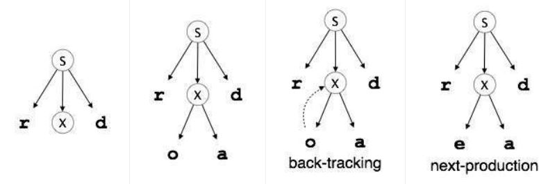
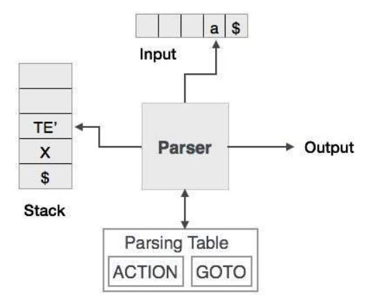
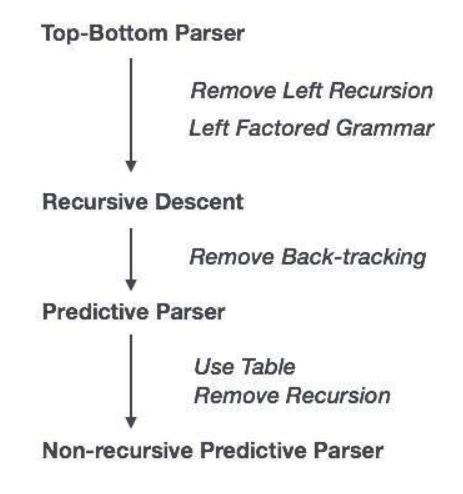
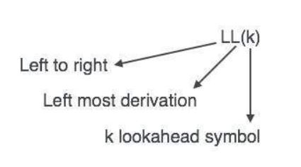
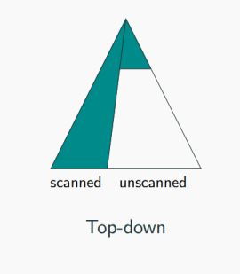

# Top Dawn Parsing

# <center>


We have learnt in the last chapter that the top-down parsing technique parses the input, and starts constructing a parse tree from the root node gradually moving down to the leaf nodes. The types of top-down parsing are depicted below:

```
                             Top-Down
                                |
                        Recursive Descent
                        |               |
                  Back-tracking  Non back-tracking
                                        |
                                 Predictive Parser
                                        |
                                    LL Parser


```

### Recursive Descent Parsing


Recursive descent is a top-down parsing technique that constructs the parse tree from the top and the input is read from left to right. It uses procedures for every terminal and non-terminal entity. This parsing technique recursively parses the input to make a parse tree, which may or may not require back-tracking. But the grammar associated with it (if not left factored) cannot avoid back-tracking. A form of recursive-descent parsing that does not require any back-tracking is known as ***predictive parsing***.

This parsing technique is regarded recursive as it uses context-free grammar which is recursive in nature.


### Back-tracking


Top- down parsers start from the root node (start symbol) and match the input string against the production rules to replace them (if matched). To understand this, take the following example of CFG:
```
S → rXd | rZd
X → oa | ea
Z → ai
```
For an input string: read, a top-down parser, will behave like this:

It will start with `S` from the production rules and will match its yield to the left-most letter of the input, i.e. `r`. The very production of `S` `(S → rXd)` matches with it. So the `top-down` parser advances to the next input letter (i.e. `e`). The parser tries to expand non-terminal `X` and checks its production from the left `(X → oa)`. It does not match with the next input symbol. So the top-down parser backtracks to obtain the next production rule of `X`, `(X → ea)`.

Now the parser matches all the input letters in an ordered manner. The string is accepted.


# <center>

### Predictive Parser


Predictive parser is a recursive descent parser, which has the capability to predict which production is to be used to replace the input string. The predictive parser does not suffer from backtracking.

To accomplish its tasks, the predictive parser uses a look-ahead pointer, which points to the next input symbols. To make the parser back-tracking free, the predictive parser puts some constraints on the grammar and accepts only a class of grammar known as LL(k) grammar.

# <center>

Predictive parsing uses a stack and a parsing table to parse the input and generate a parse tree. Both the stack and the input contains an end symbol $ to denote that the stack is empty and the input is consumed. The parser refers to the parsing table to take any decision on the input and stack element combination.

# <center>

In recursive descent parsing, the parser may have more than one production to choose from for a single instance of input, whereas in predictive parser, each step has at most one production to choose. There might be instances where there is no production matching the input string, making the parsing procedure to fail.

### LL Parser

An LL Parser accepts LL grammar. LL grammar is a subset of context-free grammar but with some restrictions to get the simplified version, in order to achieve easy implementation. LL grammar can be implemented by means of both algorithms namely, recursive-descent or table-driven.

LL parser is denoted as LL(k). The first L in LL(k) is parsing the input from left to right, the second L in LL(k) stands for left-most derivation and k itself represents the number of look aheads. Generally k = 1, so LL(k) may also be written as LL(1).

# <center>

### LL Parsing Algorithm
We may stick to deterministic LL(1) for parser explanation, as the size of table grows exponentially with the value of k. Secondly, if a given grammar is not LL(1), then usually, it is not LL(k), for any given k.


**A grammar G is LL(1) if A → α | β are two distinct productions of G:**

> for no terminal, both α and β derive strings beginning with a.
>
> at most one of α and β can derive empty string.
>
> if β → t, then α does not derive any string beginning with a terminal in FOLLOW(A).

### In summary

- Top-down (goal driven)
    - Start from the start non-terminal,
    - Grow parse tree downwards to match the input word,
    - Easier to understand and program manually.


#### For Example
input: num + num
grammar: 
    E -> E + T
    E -> T
    T -> num

**Step 1:**

| |
|-|
|E|
```
               E

```
Remaining Input: num + num


**Step 2:**

| |
|-|
|E|
|E + T|
```
                E
               /|\
              / | \
             E  |  T
                |
                |
                |
                +
```
Remaining Input: num + num


**Step 3:**

| |
|-|
|E|
|E + T|
|T + T|
```
                E
               /|\
              / | \
             E  |  T
             |  |
             T  |
                |
                +
```
Remaining Input: num + num


**Step 4:**

| |
|-|
|E|
|E + T|
|T + T|
|num + T|
```
                E
               /|\
              / | \
             E  |  T
             |  |
             T  |
             |  |
            num +
```
Remaining Input: num + num


**Step 5:**

| |
|-|
|E|
|E + T|
|T + T|
|num + T|
```
                E
               /|\
              / | \
             E  |  T
             |  |
             T  |
             |  |
            num +
```
Remaining Input:     + num


**Step 6:**

| |
|-|
|E|
|E + T|
|T + T|
|num + T|
```
                E
               /|\
              / | \
             E  |  T
             |  |  |
             T  |  |
             |  |  | 
            num + num
```
Remaining Input:       num


**Step 7:**

| |
|-|
|E|
|E + T|
|T + T|
|num + T|
```
                E
               /|\
              / | \
             E  |  T
             |  |  |
             T  |  |
             |  |  | 
            num + num
```
Remaining Input: Accepted!


> **Note:** Top-Down is easier to understand and program manually


# <center>


```
                    ________________________1________________________
                    |                       |                       |
                    2                       |                       21
                    |                       |                       |
                ____3____                   |                   ____22____
                |   |   |                   |                   |   |    |
                |   |  ____7____            |                   |   |    26
                |   | |    |    |           |                   |   |    |
                |   | 8    |  __13__        |                   |   |    27
                |   | |    |  |  |  |       |                   |   |    |
                |   | 9    |  14 |  18      |                   |   |    28
                |   | |    |  |  |  |       |                   |   |    |
                4   | 10   |  15 |  |       |                   23  |    |
                |   | |    |  |  |  |       |                   |   |    |
                5   6 11   12 16 17 19      20                  24  25   29


```

