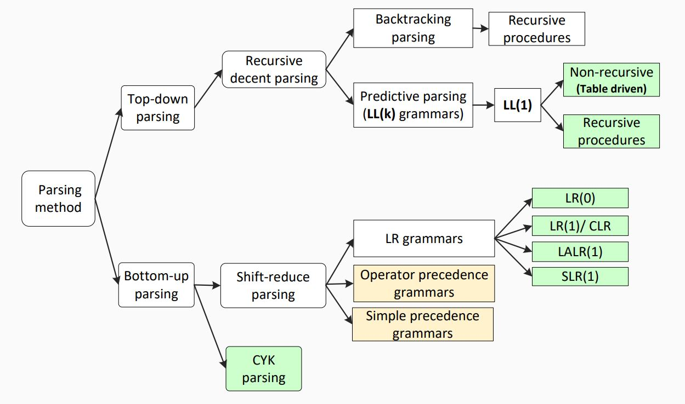

# Bottom down Parsing


Bottom-up parsing starts from the leaf nodes of a tree and works in upward direction till it reaches the root node. Here, we start from a sentence and then apply production rules in reverse manner in order to reach the start symbol. The image given below depicts the bottom-up parsers available.

### Shift-Reduce Parsing


Shift-reduce parsing uses two unique steps for bottom-up parsing. These steps are known as shift-step and reduce-step.

>- Shift step: The shift step refers to the advancement of the input pointer to the next input symbol, which is called the shifted symbol. This symbol is pushed onto the stack. The shifted symbol is treated as a single node of the parse tree.
>
>- Reduce step : When the parser finds a complete grammar rule (RHS) and replaces it to (LHS), it is known as reduce-step. This occurs when the top of the stack contains a handle. To reduce, a POP function is performed on the stack which pops off the handle and replaces it with LHS non-terminal symbol.

### LR Parser


The LR parser is a non-recursive, shift-reduce, bottom-up parser. It uses a wide class of context-free grammar which makes it the most efficient syntax analysis technique. LR parsers are also known as LR(k) parsers, where L stands for left-to-right scanning of the input stream; R stands for the construction of right-most derivation in reverse, and k denotes the number of lookahead symbols to make decisions.

There are three widely used algorithms available for constructing an LR parser:

- SLR(1) – Simple LR Parser:
    - Works on smallest class of grammar
    - Few number of states, hence very small table
    - Simple and fast construction
- LR(1) – LR Parser:
    - Works on complete set of LR(1) Grammar
    - Generates large table and large number of states
    - Slow construction
- LALR(1) – Look-Ahead LR Parser:
    - Works on intermediate size of grammar
    - Number of states are same as in SLR(1)


| LL | LR |
|:---|:---|
| Does a leftmost derivation. | Does a rightmost derivation in reverse. |
| Starts with the root nonterminal on the stack. | Ends with the root nonterminal on the stack. |
| Ends when the stack is empty. | Starts with an empty stack. |
| Uses the stack for designating what is still to be expected. | Uses the stack for designating what is already seen. |
| Builds the parse tree top-down. | Builds the parse tree bottom-up. |
| Continuously pops a nonterminal off the stack, and pushes the corresponding right hand side. | Tries to recognize a right hand side on the stack, pops it, and pushes the corresponding nonterminal. |
| Expands the non-terminals. | Reduces the non-terminals. |
| Reads the terminals when it pops one off the stack. | Reads the terminals while it pushes them on the stack. |
| Pre-order traversal of the parse tree. | Post-order traversal of the parse tree. |


### in summary


- Bottom-up (data driven)
    - Start from the input word,
    - Build up parse tree which has start non-terminal as root,
    - More powerful and used by most parser generators.


#### For Example
input: num + num
grammar: 
    E -> E + T
    E -> T
    T -> num

**Step 1:**

| |
|-|
|num + num|
```
            num
```
Remaining Input: num + num


**Step 2:**

| |
|-|
|T + num|
|num + num|
```
             T
             |
            num
```
Remaining Input: + num


**Step 3:**

| |
|-|
|E + num|
|T + num|
|num + num|
```
             E
             |
             T
             |
            num
```
Remaining Input: + num


**Step 4:**

| |
|-|
|E + T|
|E + num|
|T + num|
|num + num|
```
             E     T
             |     |
             T     |
             |     |
            num + num
```
Remaining Input: 


**Step 5:**

| |
|-|
|E|
|E + T|
|E + num|
|T + num|
|num + num|
```
                E
              / | \
             E  |  T
             |  |  |
             T  |  |
             |  |  |
            num + num
```
Remaining Input: Accepted


> **Note:** Bottom-Up Don't need to figure out as much of the parse tree for a given amount of input (more powerful)


```
                    ________________________29_______________________
                    |                       |                       |
                    18                      |                       28
                    |                       |                       |
                ____17____                  |                   ____27____
                |   |     |                 |                   |   |    |
                |   |  ____16____           |                   |   |    26
                |   | |    |    |           |                   |   |    |
                |   | 7    |  __15__        |                   |   |    25
                |   | |    |  |  |  |       |                   |   |    |
                |   | 6    |  11 |  14      |                   |   |    24
                |   | |    |  |  |  |       |                   |   |    |
                2   | 5    |  10 |  |       |                   21  |    |
                |   | |    |  |  |  |       |                   |   |    |
                1   3 4    8  9 12  13      19                  20  22   23


```


### parsing Complexity

- For certain classes of constrained CFGs, we can always parse in ***linear*** time
    - LL parsers (Use a top-down strategy)
    - LR parsers (Use a Bottom-up strategy)
- The first L means the parser reads input from ***L***eft to right without backing up

> LL: Left-to-right scan, Leftmost dervation
> LR: Left-to-right scan, rightmost dervation in revese

- Any ambiguous CFG can neithr be LL nor LR
- **Deterministic:** they produs a single correct parse without guessing or backtracking





