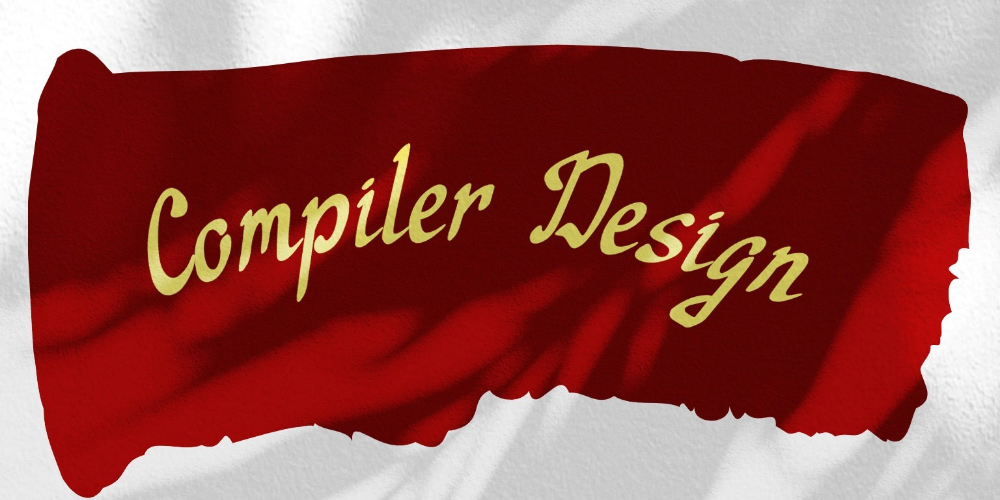

# 🎓 Compiler Design Course Pamphlets 📚

Welcome to the repository for the Compiler Design Course Pamphlets! 🎉

This repository contains a collection of pamphlets that I've created to help others understand some of the fundamental concepts in compiler design. I've taken the time to edit and rewrite these pamphlets in a more friendly and engaging way, making them easier to understand and more approachable to beginners. 📝

## 📖 Table of Contents

00. [Introduction](./Handout/00_Introduction.md)

01. [Compiler Basic](./Handout/01_Compiler-Basic.md)

02. [Bootstrapping](./Handout/02_Bootstrapping.md)

03. [Regular Expresion and Lexical Analysis](./Handout/03_Regular-Expressions-and-Lexical-Analysis.md)

04. [Manual Construction of Lexers](./Handout/04_1_Manual_Construction_of_Lexers.md)

05. [05 Automatic construction of Lexers](./Handout/05_Automatic_construction_of_Lexers.md)

06. [Syntax Analysis](./Handout/06_Syntax-Analysis.md)

07. [Types of Grammar](./Handout/07_Types-of-Grammar.md)

08. [Ambiguity Problems and Eliminating the Ambiguity](./Handout/08_Ambiguity-Problems-and-Eliminating-the-Ambiguity.md)

09. [Top Down](./Handout/09_Top-down.md)

10. [Bottom Down](./Handout/10_Bottom-down.md)

## 📚 Course Topics

These pamphlets cover a wide range of topics in compiler design, including:

## Course Overview

- **Overall Compiler Architecture and Design:**
  - Explore the fundamental structure and design principles underlying compilers.

- **Compiler Internals and Compiler Generators:**
  - Gain an in-depth understanding of the internal workings of compilers and explore tools for generating compilers.

- **Understanding Compiler Functionality:**
  - Learn what compilers do and unravel the intricacies of their functionality.

- **Insights into Compilation Processes:**
  - Grasp the inner workings of compilation processes and understand how they translate high-level code into executable machine code.

- **Hands-On Compiler Construction:**
  - Engage in practical exercises to build your own compilers, applying theoretical concepts to real-world scenarios.

- **Applied Formal Language and Automata:**
  - Explore formal language theory and automata, understanding their application in the context of compiler construction.

- **Various Parsing Methods and Techniques:**
  - Dive into different parsing methods and techniques employed in the analysis of source code.

- **Low-Level Code Generation and Optimization:**
  - Learn about the intricacies of generating efficient low-level code and optimizing it for enhanced performance.

- **Intellectual Paradigms in System Programming and Testing:**
  - Gain insights into the intellectual paradigms that underpin system programming and the crucial role of testing in compiler development.

Embark on this educational journey, where you will not only gain theoretical knowledge but also acquire practical skills in building and understanding compilers. Let's explore the intricate world of compiler design together.

## 👩‍💻 Contributing

I welcome contributions to these pamphlets! If you have any suggestions or improvements, please feel free to submit a pull request. I'm always looking for ways to improve these pamphlets and make them more helpful to others. 🙌
